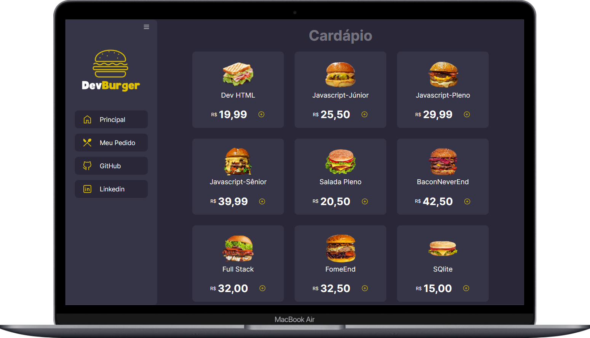

# 🍔 Dev Burger

Aplicação web que simula um sistema de uma hamburgueria com tema de programação.

## 🛠️ Tecnologias utilizadas
- HTML5
- CSS3
- JavaScript
- Git e Github

## 🎨 Design
- Prototipação: [Canva](https://www.canva.com/pt_br/)
- Ideias de cores: [Desafio 8 do #boracodar da Rocketseat](https://www.rocketseat.com.br/boracodar)
- Ícones: [Tabler Icons](https://tablericons.com/) e [Boostrap Icons](https://icons.getbootstrap.com/)
- Fontes: [Google Fonts](https://fonts.google.com)